## (98.8% solution) German sign classification using deep learning neural networks

### Vivek Yadav, PhD

This repository contains the work I did for Udacity's Traffic sign classification project which part of their Self-driving Car Nano Degree. I also made a medium post about this documenting the general approach. This repository presents the code to train a convolutional network to identify German Traffic Signs. Before getting into detailed modeling below are some benchmark results,


| Model        | Accuracy           | Authors  |
| ------------- |:-------------:| -----: |
| Spatial Transformer     | 99.81% | [Haloi](https://arxiv.org/pdf/1511.02992.pdf)  |
| Committee of CNNs      | 99.47%      |  [Yann LeCun](http://yann.lecun.com/exdb/publis/pdf/sermanet-ijcnn-11.pdf) |
|This model+brightness augmentation | 99.1%      | [Yadav](https://medium.com/@vivek.yadav/german-sign-classification-using-deep-learning-neural-networks-98-8-solution-d05656bf51ad#.b06l1wwwg)   |
| This model | 98.8%      | [Yadav](https://medium.com/@vivek.yadav/german-sign-classification-using-deep-learning-neural-networks-98-8-solution-d05656bf51ad#.b06l1wwwg)   |
| Human Accuracy | 98.32%      | [Humans](http://benchmark.ini.rub.de/)   |


The file below presents training scheme. You can download the final trained model from [here](https://drive.google.com/file/d/0B1fs4jieX9OOVi0ybDdTQTBlbGM/view?usp=sharing).

###### File set up:

1. Make a main folder for the project
2. Download data from [here](https://d17h27t6h515a5.cloudfront.net/topher/2016/November/581faac4_traffic-signs-data/traffic-signs-data.zip), and put them in a folder called 'TrafficSignData' within the main project folder.
3. Run Traffic_signs_Col_val_final2.ipynb from the main folder.


The rest of the post is organized as follows,

1. Exploratory data analysis
2. Data augmentation and preprocessing
3. Model architecture
4. Training
5. Model performance on German sign test data and model performance on unseen data

---

### 1. Exploratory data analysis EDA

First we will familiarize ourselves with the data itself. The German sign data consists of many signs as shown below. We further expect each sign to be present only at relevant locations, therefore there is a difference in number of signs one would expect to see. In this data set the most common sign was the 20 kmph sign. We will not change the relative number of these signs because the incidence rates in the data reflects prior probability of observing a new sign. Leaving relative ratio of images unchanged biases the model towards predicting more frequent sign when the model is unsure between two signs.


```python
#importing some useful packages
import os
import matplotlib.pyplot as plt
import matplotlib.gridspec as gridspec
import math
import cv2
import time as time
from sklearn.preprocessing import OneHotEncoder
from sklearn.cross_validation import train_test_split
import numpy as np
%matplotlib inline
import tensorflow as tf
import prettytensor as pt
from PIL import Image
import time
from datetime import timedelta
import numpy as np
import pandas as pd
from sklearn.metrics import confusion_matrix
```


```python
def OHE_labels(Y_tr,N_classes):
    OHC = OneHotEncoder()

    Y_ohc = OHC.fit(np.arange(N_classes).reshape(-1, 1))
    Y_labels = Y_ohc.transform(Y_tr.reshape(-1, 1)).toarray()
    return Y_labels
```


```python
# Load pickled data
import pickle


# TODO: fill this in based on where you saved the training and testing data
training_file = 'TrafficSignData/train.p'
testing_file = 'TrafficSignData/test.p'

with open(training_file, mode='rb') as f:
    train = pickle.load(f)
with open(testing_file, mode='rb') as f:
    test = pickle.load(f)

X_train, y_train = train['features'], train['labels']
X_test, y_test = test['features'], test['labels']
labels_train = OHE_labels(y_train,43)
labels_test = OHE_labels(y_test,43)
```


```python
def check_OHE(cls,y):
    check = np.linalg.norm(np.argmax(cls,axis=1)-y)
    if check == 0:
        print('One hot encoding correct, ok to proceed')
    else:
        print('One hot encoding doesnt match the output, check code!!!')

```


```python
check_OHE(labels_test,y_test)
check_OHE(labels_train,y_train)
```

    One hot encoding correct, ok to proceed
    One hot encoding correct, ok to proceed


```python

```


```python
### To start off let's do a basic data summary.

# TODO: number of training examples
n_train = len(y_train)

# TODO: number of testing examples
n_test = len(y_test)

# TODO: what's the shape of an image?
image_shape = np.shape(X_train[1])
# TODO: how many classes are in the dataset
n_classes = len(np.unique(y_train))

print("Number of training examples =", n_train)
print("Number of testing examples =", n_test)
print("Image data shape =", image_shape)
print("Number of classes =", n_classes)
```

    Number of training examples = 39209
    Number of testing examples = 12630
    Image data shape = (32, 32, 3)
    Number of classes = 43


### 2. Data augmentation and preprocessing

A big limitation of deep neural networks is that they may have millions of parameters, tuning which requires a vast data set. This however is not always possible. In such cases, data augmentation helps us generate additional training examples. We will generate additional data samples by applying affine transformation to the image. Affine transformations refer to transformations that do not alter the parallelism of lines, i.e. can be represented as a linear operation on the matrix. We will specifically use rotation, shearing and translation to simulate the effect of viewing the sign from different angles and different distances. Figure below presents original image and augmented images generated from it.


I applied the following preprocessing for image data,

1. I first applied histogram equalization so the effect of brightness is removed. I used openCV'2 cv2
2. I first scaled images between -.5 and .5, by dividing by 255. and subtracting .5.

As there was limited data, and the number of images in each class were different, I generated additional data by jittering the images. For jittering, I rotated the images by random number generated between +/- 40 degress, shifted them by +/- 10 pixels along vertical and horizontal, and a final shearing transformation. After this transformation, the image get transformed as follows.


```python
def plot_random_3C(n_row,n_col,X,y):

    plt.figure(figsize = (11,8))
    gs1 = gridspec.GridSpec(n_row,n_row)
    gs1.update(wspace=0.01, hspace=0.02) # set the spacing between axes.

    for i in range(n_row*n_col):
        # i = i + 1 # grid spec indexes from 0
        ax1 = plt.subplot(gs1[i])
        plt.axis('on')
        ax1.set_xticklabels([])
        ax1.set_yticklabels([])
        ax1.set_aspect('equal')
        #plt.subplot(4,11,i+1)
        ind_plot = np.random.randint(1,len(y))
        plt.imshow(X[ind_plot])
        plt.text(2,4,str(y[ind_plot]),
             color='k',backgroundcolor='c')
        plt.axis('off')
    plt.show()
def plot_random_1C(n_row,n_col,X,y):

    plt.figure(figsize = (11,8))
    gs1 = gridspec.GridSpec(n_row,n_row)
    gs1.update(wspace=0.01, hspace=0.02) # set the spacing between axes.

    for i in range(n_row*n_col):
        # i = i + 1 # grid spec indexes from 0
        ax1 = plt.subplot(gs1[i])
        plt.axis('on')
        ax1.set_xticklabels([])
        ax1.set_yticklabels([])
        ax1.set_aspect('equal')
        #plt.subplot(4,11,i+1)
        ind_plot = np.random.randint(1,len(y))
        plt.imshow(X[ind_plot],cmap='gray')
        plt.text(2,4,str(y[ind_plot]),
             color='k',backgroundcolor='c')
        plt.axis('off')
    plt.show()   
def plot_random_preprocess(n_row,n_col,X,y):

    plt.figure(figsize = (11,8))
    gs1 = gridspec.GridSpec(n_row,n_row)
    gs1.update(wspace=0.01, hspace=0.02) # set the spacing between axes.

    for i in range(n_row*n_col):
        # i = i + 1 # grid spec indexes from 0
        ax1 = plt.subplot(gs1[i])
        plt.axis('on')
        ax1.set_xticklabels([])
        ax1.set_yticklabels([])
        ax1.set_aspect('equal')
        #plt.subplot(4,11,i+1)
        ind_plot = np.random.randint(1,len(y))
        plt.imshow(pre_process_image(X[ind_plot]),cmap='gray')
        plt.text(2,4,str(y[ind_plot]),
             color='k',backgroundcolor='c')
        plt.axis('off')
    plt.show()


def pre_process_image(image):

    #image = cv2.cvtColor(image, cv2.COLOR_BGR2YUV)
    #image = image[:,:,0]
    image[:,:,0] = cv2.equalizeHist(image[:,:,0])
    image[:,:,1] = cv2.equalizeHist(image[:,:,1])
    image[:,:,2] = cv2.equalizeHist(image[:,:,2])
    image = image/255.-.5
    #image = cv2.resize(image, (img_resize,img_resize),interpolation = cv2.INTER_CUBIC)

    return image
```


```python
plot_random_3C(4,4,X_train,y_train)
```


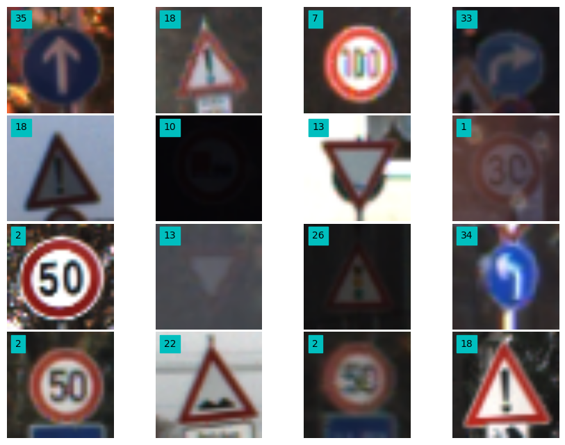


```python
img_resize = 32
N_classes = 43
image_shape = (img_resize,img_resize)
img_size_flat = img_resize*img_resize


image_GS_train = np.array([pre_process_image(X_train[i]) for i in range(len(X_train))],
                          dtype = np.float32)
image_GS_test = np.array([pre_process_image(X_test[i]) for i in range(len(X_test))],
                          dtype = np.float32)
```


```python

```


```python
plot_random_3C(4,4,image_GS_train+.5,y_train)
```


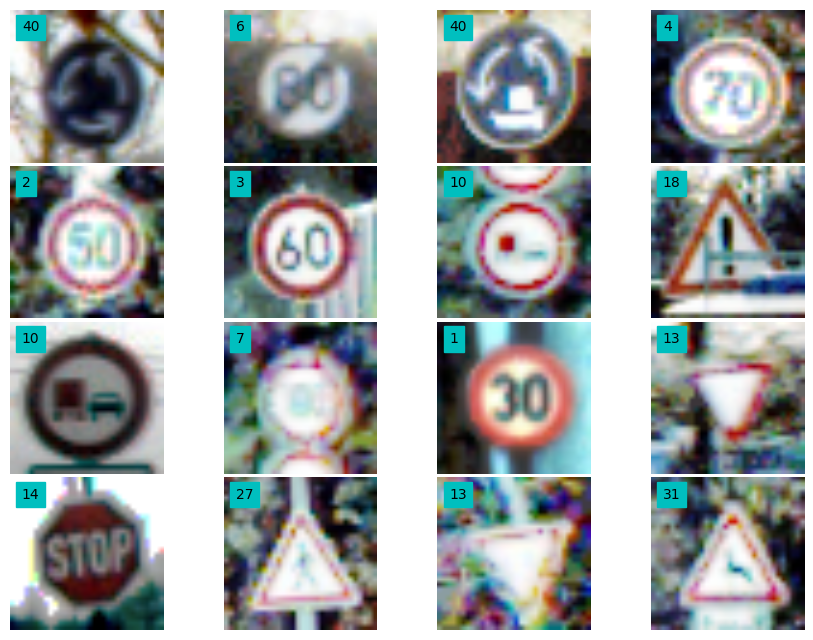


```python
data_i = [[i,sum(y_train == i)] for i in range(len(np.unique(y_train)))]
data_i_sorted = sorted(data_i, key=lambda x: x[1])
```


```python
data_pd = pd.read_csv('signnames.csv')
```


```python
data_pd['Occurance'] = pd.Series(np.asarray(data_i_sorted).T[1], index=np.asarray(data_i_sorted).T[0])
data_pd_sorted = data_pd.sort_values(['Occurance'],ascending=[0]).reset_index()
data_pd_sorted = data_pd_sorted.drop('index', 1)

```


```python
data_pd_sorted.head(10)
```


<div>
<table border="1" class="dataframe">
  <thead>
    <tr style="text-align: right;">
      <th></th>
      <th>ClassId</th>
      <th>SignName</th>
      <th>Occurance</th>
    </tr>
  </thead>
  <tbody>
    <tr>
      <th>0</th>
      <td>2</td>
      <td>Speed limit (50km/h)</td>
      <td>2250</td>
    </tr>
    <tr>
      <th>1</th>
      <td>1</td>
      <td>Speed limit (30km/h)</td>
      <td>2220</td>
    </tr>
    <tr>
      <th>2</th>
      <td>13</td>
      <td>Yield</td>
      <td>2160</td>
    </tr>
    <tr>
      <th>3</th>
      <td>12</td>
      <td>Priority road</td>
      <td>2100</td>
    </tr>
    <tr>
      <th>4</th>
      <td>38</td>
      <td>Keep right</td>
      <td>2070</td>
    </tr>
    <tr>
      <th>5</th>
      <td>10</td>
      <td>No passing for vechiles over 3.5 metric tons</td>
      <td>2010</td>
    </tr>
    <tr>
      <th>6</th>
      <td>4</td>
      <td>Speed limit (70km/h)</td>
      <td>1980</td>
    </tr>
    <tr>
      <th>7</th>
      <td>5</td>
      <td>Speed limit (80km/h)</td>
      <td>1860</td>
    </tr>
    <tr>
      <th>8</th>
      <td>25</td>
      <td>Road work</td>
      <td>1500</td>
    </tr>
    <tr>
      <th>9</th>
      <td>9</td>
      <td>No passing</td>
      <td>1470</td>
    </tr>
  </tbody>
</table>
</div>


```python
data_pd_sorted.tail(10)
```


<div>
<table border="1" class="dataframe">
  <thead>
    <tr style="text-align: right;">
      <th></th>
      <th>ClassId</th>
      <th>SignName</th>
      <th>Occurance</th>
    </tr>
  </thead>
  <tbody>
    <tr>
      <th>33</th>
      <td>39</td>
      <td>Keep left</td>
      <td>300</td>
    </tr>
    <tr>
      <th>34</th>
      <td>29</td>
      <td>Bicycles crossing</td>
      <td>270</td>
    </tr>
    <tr>
      <th>35</th>
      <td>24</td>
      <td>Road narrows on the right</td>
      <td>270</td>
    </tr>
    <tr>
      <th>36</th>
      <td>41</td>
      <td>End of no passing</td>
      <td>240</td>
    </tr>
    <tr>
      <th>37</th>
      <td>42</td>
      <td>End of no passing by vechiles over 3.5 metric ...</td>
      <td>240</td>
    </tr>
    <tr>
      <th>38</th>
      <td>32</td>
      <td>End of all speed and passing limits</td>
      <td>240</td>
    </tr>
    <tr>
      <th>39</th>
      <td>27</td>
      <td>Pedestrians</td>
      <td>240</td>
    </tr>
    <tr>
      <th>40</th>
      <td>37</td>
      <td>Go straight or left</td>
      <td>210</td>
    </tr>
    <tr>
      <th>41</th>
      <td>19</td>
      <td>Dangerous curve to the left</td>
      <td>210</td>
    </tr>
    <tr>
      <th>42</th>
      <td>0</td>
      <td>Speed limit (20km/h)</td>
      <td>210</td>
    </tr>
  </tbody>
</table>
</div>


```python
plt.figure(figsize=(12,8))
plt.bar(range(43),height=data_pd_sorted["Occurance"])
```


    <Container object of 43 artists>


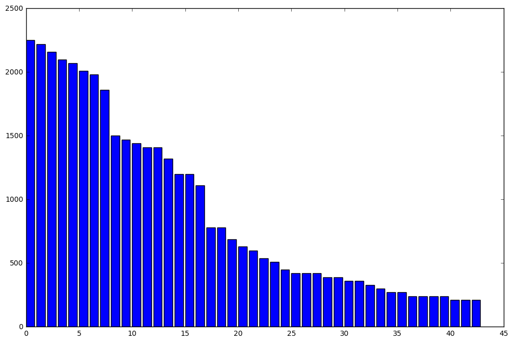


```python
img_resize = 32
def transform_image(image,ang_range,shear_range,trans_range):

    # Rotation

    ang_rot = np.random.uniform(ang_range)-ang_range/2
    rows,cols,ch = image.shape    
    Rot_M = cv2.getRotationMatrix2D((cols/2,rows/2),ang_rot,1)

    # Translation
    tr_x = trans_range*np.random.uniform()-trans_range/2
    tr_y = trans_range*np.random.uniform()-trans_range/2
    Trans_M = np.float32([[1,0,tr_x],[0,1,tr_y]])

    # Shear
    pts1 = np.float32([[5,5],[20,5],[5,20]])

    pt1 = 5+shear_range*np.random.uniform()-shear_range/2
    pt2 = 20+shear_range*np.random.uniform()-shear_range/2

    pts2 = np.float32([[pt1,5],[pt2,pt1],[5,pt2]])

    shear_M = cv2.getAffineTransform(pts1,pts2)

    image = cv2.warpAffine(image,Rot_M,(cols,rows))
    image = cv2.warpAffine(image,Trans_M,(cols,rows))
    image = cv2.warpAffine(image,shear_M,(cols,rows))

    image = pre_process_image(image)

    #image = cv2.cvtColor(image, cv2.COLOR_BGR2YUV)
    #image = image[:,:,0]
    #image = cv2.resize(image, (img_resize,img_resize),interpolation = cv2.INTER_CUBIC)

    return image

def get_index_dict(y_train):
    # Returns indices of each label
    # Assumes that the labels are 0 to N-1
    dict_indices = {}
    ind_all = np.arange(len(y_train))

    for i in range(len(np.unique(y_train))):
        ind_i = ind_all[y_train == i]
        dict_indices[i] = ind_i
        #print(ind_i)
    return dict_indices

def gen_transformed_data(X_train,y_train,N_classes,n_each,ang_range,shear_range,trans_range,randomize_Var):

   dict_indices = get_index_dict(y_train)
   n_class = len(np.unique(y_train))
   X_arr = []
   Y_arr = []
   for i in range(n_class):
       len_i = len(dict_indices[i])
       ind_rand = np.random.randint(0,len_i,n_each)
       ind_dict_class  = dict_indices[i]

       for i_n in range(n_each):
           img_trf = transform_image(X_train[ind_dict_class[ind_rand[i_n]]],
                                     ang_range,shear_range,trans_range)
           X_arr.append(img_trf)
           Y_arr.append(i)

   X_arr = np.array(X_arr,dtype = np.float32())
   Y_arr = np.array(Y_arr,dtype = np.float32())

   if (randomize_Var == 1):
       len_arr = np.arange(len(Y_arr))
       np.random.shuffle(len_arr)
       X_arr[len_arr] = X_arr
       Y_arr[len_arr] = Y_arr

   labels_arr = OHE_labels(Y_arr,43)

   return X_arr,Y_arr,labels_arr


def gen_extra_data(X_train,y_train,N_classes,n_each,ang_range,shear_range,trans_range,randomize_Var):

    dict_indices = get_index_dict(y_train)
    n_class = len(np.unique(y_train))
    X_arr = []
    Y_arr = []
    n_train = len(X_train)
    for i in range(n_train):
        #X_arr.append(transform_image(X_train[i],0,0,0)/255.)
        #Y_arr.append(y_train[i])
        for i_n in range(n_each):
            img_trf = transform_image(X_train[i],
                                      ang_range,shear_range,trans_range)
            X_arr.append(img_trf)
            Y_arr.append(y_train[i])

    X_arr = np.array(X_arr,dtype = np.float32())
    Y_arr = np.array(Y_arr,dtype = np.float32())

    if (randomize_Var == 1):
        len_arr = np.arange(len(Y_arr))
        np.random.shuffle(len_arr)
        X_arr[len_arr] = X_arr
        Y_arr[len_arr] = Y_arr

    labels_arr = OHE_labels(Y_arr,43)

    return X_arr,Y_arr,labels_arr
```


```python
Image_train_GS_rot,y_train_rot,labels_train_rot = gen_transformed_data(X_train,y_train,
                                                                       43,10,30,5,5,1)
```


```python
def random_batch():
    # Number of images in the training-set.
    num_images = len(Image_train_GS_rot_1)

    # Create a random index.
    idx = np.random.choice(num_images,
                           size=batch_size,
                           replace=False)

    # Use the random index to select random images and labels.
    features_batch = Image_train_GS_rot_1[idx, :,:,:]
    labels_batch = labels_train_rot[idx, :]

    return features_batch, labels_batch
```


```python
def get_weights(shape):
    return tf.Variable(tf.truncated_normal(shape, stddev=0.05))
def get_biases(length):
    return tf.Variable(tf.constant(0.05, shape=[length]))

def conv_layer(input,
               num_inp_channels,
               filter_size,
               num_filters,
              use_pooling):
    shape = [filter_size, filter_size, num_inp_channels,num_filters]
    weights = get_weights(shape)
    biases = get_biases(num_filters)
    layer = tf.nn.conv2d(input = input,
                        filter = weights,
                        strides = [1,1,1,1],
                        padding = 'SAME')

    layer += biases

    if use_pooling:
        layer = tf.nn.max_pool(value=layer,
                         ksize=[1, 2, 2, 1],
                         strides=[1, 2, 2, 1],
                         padding='SAME')
    layer = tf.nn.relu(layer)

    return layer, weights
```


```python
def flatten_layer(layer):
    # Get the shape of the input layer.
    layer_shape = layer.get_shape()
    num_features = layer_shape[1:4].num_elements()
    layer_flat = tf.reshape(layer, [-1, num_features])
    return layer_flat, num_features
```


```python
def fc_layer(input,          # The previous layer.
             num_inputs,     # Num. inputs from prev. layer.
             num_outputs,    # Num. outputs.
             use_relu=True): # Use Rectified Linear Unit (ReLU)?
    weights = get_weights(shape=[num_inputs, num_outputs])
    biases = get_biases(length=num_outputs)
    layer = tf.matmul(input, weights) + biases

    if use_relu:
        layer = tf.nn.relu(layer)

    return layer,weights

def dropout_layer(layer, keep_prob):
    layer_drop = tf.nn.dropout(layer, keep_prob)
    return layer_drop
```


```python
img_size = 32
num_channels = 3
Image_train_GS_rot_1 = Image_train_GS_rot
image_GS_test_1 = image_GS_test
```


```python
plt.imshow(Image_train_GS_rot_1[5]);
```


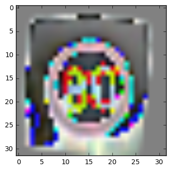


```python
features = tf.placeholder(tf.float32, shape=[None, img_size, img_size,num_channels],
                   name='features')
labels_true = tf.placeholder(tf.float32,shape=[None,N_classes], name='y_true')

labels_true_cls = tf.argmax(labels_true, dimension=1)

```

### 3. Model architecture

Figure below presents the model architecture we will use. This architecture was converged upon after trying several different architectures.


The first module in the model above is comprised of 3 1X1 filters. These filters have the effect of changing color maps. In most applications, changing color map can result in significant improvements in performance. However, it is not clear what the best color map is for different applications, therefore using 3 1X1 filters results in a case were the network itself ends up choosing the best color map.

The next 3 modules are composed of 32, 64 and 128 (respectively) 3X3 filters followed by maxpooling and dropouts. The output from each of the convolution module is fed into a feedforward layer. Rationale being that the fully connected layer has access to outputs from low level and higher level filters and has the ability to choose the features that works the best. The feedfoward layers are composed of 2 hidden layers with 1024 neurons in each layer. Additional dropout layers are applied after each of the fully connected layers.

The idea of using drop outs heavily is to avoid overfitting and force the network to learn multiple models for the same data. The effect of adding dropouts is explained in detail in a previous medium post, https://medium.com/@vivek.yadav/why-dropouts-prevent-overfitting-in-deep-neural-networks-937e2543a701#.5v3w4fl2d

The last softmax layer is used to compute the log-loss of model prediction. In addition a l2- regularization cost is included to penalize large model weights.


```python
## Convlayer 0
filter_size0 = 1
num_filters0 = 3

## Convlayer 1
filter_size1 = 5
num_filters1 = 32
## Convlayer 2
filter_size2 = 5
num_filters2 = 32

## Convlayer 3
filter_size3 = 5
num_filters3 = 64
## Convlayer 4
filter_size4 = 5
num_filters4 = 64

## Convlayer 5
filter_size5 = 5
num_filters5 = 128
## Convlayer 6
filter_size6 = 5
num_filters6 = 128

## FC_size
fc_size1 = 1024
## FC_size
fc_size2 = 1024

## Dropout
#drop_prob = 0.5

keep_prob = tf.placeholder(tf.float32)
```


```python
layer_conv0, weights_conv0 = \
        conv_layer(input=features,
                   num_inp_channels=num_channels,
                   filter_size=filter_size0,
                   num_filters=num_filters0,
                   use_pooling=False)

layer_conv1, weights_conv1 = \
        conv_layer(input=layer_conv0,
                   num_inp_channels=num_filters0,
                   filter_size=filter_size1,
                   num_filters=num_filters1,
                   use_pooling=False)
layer_conv2, weights_conv2 = \
        conv_layer(input=layer_conv1,
                   num_inp_channels=num_filters1,
                   filter_size=filter_size2,
                   num_filters=num_filters2,
                   use_pooling=True)
layer_conv2_drop = dropout_layer(layer_conv2, keep_prob)

layer_conv3, weights_conv3 = \
        conv_layer(input=layer_conv2_drop,
                   num_inp_channels=num_filters2,
                   filter_size=filter_size3,
                   num_filters=num_filters3,
                   use_pooling=False)
layer_conv4, weights_conv4= \
        conv_layer(input=layer_conv3,
                   num_inp_channels=num_filters3,
                   filter_size=filter_size4,
                   num_filters=num_filters4,
                   use_pooling=True)
layer_conv4_drop = dropout_layer(layer_conv4, keep_prob)

layer_conv5, weights_conv5 = \
        conv_layer(input=layer_conv4_drop,
                   num_inp_channels=num_filters4,
                   filter_size=filter_size5,
                   num_filters=num_filters5,
                   use_pooling=False)
layer_conv6, weights_conv6 = \
        conv_layer(input=layer_conv5,
                   num_inp_channels=num_filters5,
                   filter_size=filter_size6,
                   num_filters=num_filters6,
                   use_pooling=True)    
layer_conv6_drop = dropout_layer(layer_conv6, keep_prob)


layer_flat2, num_fc_layers2 = flatten_layer(layer_conv2_drop)
layer_flat4, num_fc_layers4 = flatten_layer(layer_conv4_drop)
layer_flat6, num_fc_layers6 = flatten_layer(layer_conv6_drop)

layer_flat = tf.concat(1, [layer_flat2, layer_flat4, layer_flat6])
num_fc_layers = num_fc_layers2+num_fc_layers4+num_fc_layers6

fc_layer1,weights_fc1 = fc_layer(layer_flat,          # The previous layer.
             num_fc_layers,     # Num. inputs from prev. layer.
             fc_size1,    # Num. outputs.
             use_relu=True)
fc_layer1_drop = dropout_layer(fc_layer1, keep_prob)

fc_layer2,weights_fc2 = fc_layer(fc_layer1_drop,          # The previous layer.
             fc_size1,     # Num. inputs from prev. layer.
             fc_size2,    # Num. outputs.
             use_relu=True)
fc_layer2_drop = dropout_layer(fc_layer2, keep_prob)

fc_layer3,weights_fc3 = fc_layer(fc_layer2_drop,          # The previous layer.
             fc_size2,     # Num. inputs from prev. layer.
             n_classes,    # Num. outputs.
             use_relu=False)

labels_pred = tf.nn.softmax(fc_layer3)
labels_pred_cls = tf.argmax(labels_pred, dimension=1)

regularizers = (tf.nn.l2_loss(weights_conv0)
                + tf.nn.l2_loss(weights_conv1) + tf.nn.l2_loss(weights_conv2)
                + tf.nn.l2_loss(weights_conv3) + tf.nn.l2_loss(weights_conv4)
                + tf.nn.l2_loss(weights_conv5) + tf.nn.l2_loss(weights_conv6)
                + tf.nn.l2_loss(weights_fc1)  + tf.nn.l2_loss(weights_fc2) +
                tf.nn.l2_loss(weights_fc3))
```


```python
cross_entropy = tf.nn.softmax_cross_entropy_with_logits(logits=fc_layer3,
                                                        labels=labels_true)
```


```python
cost = tf.reduce_mean(cross_entropy)+1e-5*regularizers

```


```python
optimizer = tf.train.AdamOptimizer(learning_rate=1e-3).minimize(cost)

```


```python
correct_prediction = tf.equal(labels_pred_cls, labels_true_cls)
accuracy = tf.reduce_mean(tf.cast(correct_prediction, tf.float32))
```


```python
batch_size = 100

```


```python
def optimize(num_iterations):
    global total_iterations
    global best_validation_accuracy
    global last_improvement
    global best_test_accuracy

    global val_acc_list
    global batch_acc_list
    global test_acc_list

    #num_iter = np.math.floor(len(labels_train_rot)/batch_size)
    #num_iter = min(num_iter-2,num_iterations)
    num_iter = num_iterations
    for i in range(num_iter):
        total_iterations+=1
        # Get batch for training
        features_batch, labels_true_batch = random_batch()
        #idx = np.arange(batch_size*i,batch_size*(i+1))
        #features_batch = Image_GS_train_rot[idx, :,:,:]
        #labels_true_batch = labels_train_rot[idx, :]f
        feed_dict_batch = {features:features_batch,
                            labels_true: labels_true_batch,
                            keep_prob: 0.5}
        session.run(optimizer,feed_dict = feed_dict_batch)

        if ((total_iterations % 200 == 0) or (i == (num_iter - 1))):
            # Calculate the accuracy on the training-set.
            acc_batch = session.run(accuracy, feed_dict=feed_dict_batch)
            acc_valid = session.run(accuracy,feed_dict=feed_dict_valid)
            val_acc_list.append(acc_valid)
            batch_acc_list.append(acc_batch)
            if acc_valid > best_validation_accuracy:
                best_validation_accuracy = acc_valid
                last_improvement = total_iterations
                improved_str = '*'
                saver = tf.train.Saver()
                saver.save(sess=session, save_path='model_best_batch')
            else:
                improved_str = ''

            if total_iterations - last_improvement > require_improvement:
                print("No improvement found in a while, stopping optimization.")
                break

            # Message for printing.
            if ((total_iterations % 5000 == 0) or (i == (num_iter - 1))):
                msg = "# {0:>6}, Train Acc.: {1:>6.1%}, Val Acc.: {2:>6.1%}, Test Acc.: {3:>6.1%}"
                acc_test = session.run(accuracy,feed_dict=feed_dict_test)

                if best_test_accuracy<acc_test:
                    saver = tf.train.Saver()
                    saver.save(sess=session, save_path='model_best_test')
                    best_test_accuracy = acc_test
                    #print_accuracy()
                # Print it.
                print(msg.format(i+1, acc_batch,acc_valid,
                                     acc_test))

```

### 4. Training:

We will first start with large augmentation so the model learns overall features of traffic sign, and we will gradually reduce the augmentation to fine tune the model. The training is carried out in the following steps,

1. Generate 10 new images per image in the training set using data augmentation
2. Split data into training and validation sets such that the validation set is 25% of the training set.
3. After first 10 epochs, lower the augmentation by a factor of 0.9 per epoch.


**Additional notes:**

1. *** Hyperparameters***: I chose a learning rate of 1e-3, batch size of 256 and a L-2 regularization on weights of \\( 10^{-5} \\) to avoid overfitting, and ran optimization for a total of 22 epochs.
2. *** Training/validation data***: I generated tranformed data using the technique described in question 1. However, I reduced the augmentation of images as training progressed. The main idea was to provide very noisy data so the neural network can first learn coarse features, and then reduced augmentation to learn finer features. I performed large image augmentations in the initial 4 epochs, and in the next 18 epochs, I reduced augmentation parameters by a factor of 0.9 per epoch.
3. *** Epochs ***: I ran a total of 22 epochs for training the neural network. In each epoch, I trained the model for 20000 iterations in the first 4 epochs, but for 10000 in the following 18 iterations.
3. *** Stopping conditions ***: I used accuracy of validation data as a criteria to monitor if model was overfitting. In the first 4 epochs, I did not use early stopping in the first 4 epochs. But after the first 4 epochs, I stopped training if the validation score didnt improve for 1000 consecutive iterations.

4. *** Optimization ***: I used adamoptimizer with default settings for optimization. The optimization process itself took about 4 hours.


```python
def print_accuracy():
    acc = session.run(accuracy,feed_dict=feed_dict_test)
    print("Accuracy on test set: {0:>6.1%}".format(acc))

def print_confusion_matrix():
    labels_cls_pred = session.run(labels_pred_cls,feed_dict=feed_dict_test)
    cm = confusion_matrix(y_true = y_test,y_pred = labels_cls_pred)
    print(cm)
    plt.imshow(cm, interpolation='nearest', cmap=plt.cm.Blues)

    # Make various adjustments to the plot.
    plt.tight_layout()
    plt.colorbar()
    tick_marks = np.arange(N_classes)
    plt.xticks(tick_marks, range(N_classes))
    plt.yticks(tick_marks, range(N_classes))
    plt.xlabel('Predicted')
    plt.ylabel('True')

def plot_error_examples():
    correct,labels_cls_pred = session.run([correct_prediction,labels_pred_cls],
                                          feed_dict=feed_dict_test)
    incorrect = (correct == False)
    X_incorrect = X_test[incorrect]
    y_incorrect = y_test[incorrect]
    y_pred = labels_cls_pred[incorrect]

    plot_random_3C(3,3,X_incorrect,y_incorrect)

def plot_weights():
    # Get the values for the weights from the TensorFlow variable.
    w = session.run(weights)

    # Get the lowest and highest values for the weights.
    # This is used to correct the colour intensity across
    # the images so they can be compared with each other.
    w_min = np.min(w)
    w_max = np.max(w)

    # Create figure with 3x4 sub-plots,
    # where the last 2 sub-plots are unused.
    fig, axes = plt.subplots(3, 4)
    fig.subplots_adjust(hspace=0.3, wspace=0.3)

    for i, ax in enumerate(axes.flat):
        # Only use the weights for the first 10 sub-plots.
        if i<13:
            # Get the weights for the i'th digit and reshape it.
            # Note that w.shape == (img_size_flat, 10)
            image = w[:, i].reshape(image_shape)

            # Set the label for the sub-plot.
            ax.set_xlabel("Weights: {0}".format(i))

            # Plot the image.
            ax.imshow(image, vmin=w_min, vmax=w_max, cmap='seismic')

        # Remove ticks from each sub-plot.
        ax.set_xticks([])
        ax.set_yticks([])
```


```python
feed_dict_test = {features: image_GS_test_1,
                 labels_true: labels_test,
                 labels_true_cls:y_test,
                 keep_prob:1.0}
```


```python
session = tf.Session()
session.run(tf.initialize_all_variables())

```


```python
print_accuracy()
```

    Accuracy on test set:   1.0%


```python
val_acc_list = []
batch_acc_list = []
train_acc_list = []
```


```python
batch_size = 512

```

### 5. Model performance:

Once all the parameters were identified, the model took 1/2 an hour of training on Nvidia’s Titan X. Complete build of the machine I used can be found here, https://medium.com/@vivek.yadav/deep-learning-machine-first-build-experience-d04abf198831#.z79hv7drs . After training, the performance on German test data was just above 98.8%.


```python
start_time = time.time()
total_iterations = 0
require_improvement = 10000
ang_rot = 10
trans_rot = 2
shear_rot = 2
n_opt = 40000
best_test_accuracy = 0.0

for i_train in range(1):
    best_validation_accuracy = 0.0
    last_improvement = 0

    #Image_train_GS_rot,y_train_rot,labels_train_rot = gen_transformed_data(X_train,y_train,43,5000,30,5,5,1)


    if i_train>-1:
        ang_rot = 10*0.9**(i_train)
        trans_rot = 2*0.9**(i_train)
        shear_rot = 2*0.9**(i_train)
        require_improvement = 5000
        n_opt = 10000


    X_train_SS, X_valid_SS, y_train_SS , y_valid_SS = \
                                train_test_split(X_train,
                                                 y_train,
                                                 test_size=0.1,
                                                 random_state=22)
    labels_valid_SS = OHE_labels(y_valid_SS,43)
    image_GS_valid = np.array([pre_process_image(X_valid_SS[i]) for i in range(len(X_valid_SS))],
                          dtype = np.float32)
    #image_GS_valid = np.reshape(image_GS_valid,(-1,32,32,1))

    feed_dict_valid = {features: image_GS_valid,
                 labels_true: labels_valid_SS,
                 labels_true_cls:y_valid_SS,
                 keep_prob:1.0}

    Image_train_GS_rot,y_train_rot,labels_train_rot = gen_extra_data(X_train_SS,y_train_SS,43,5,
                                                                     ang_rot,trans_rot,shear_rot,1)
    print('Optimization Loop # '+str(i_train))    
    Image_train_GS_rot_1 = Image_train_GS_rot
    #np.reshape(Image_train_GS_rot,(-1,32,32,1))
    #
    optimize(n_opt)
    #print_accuracy()


end_time = time.time()

time_diff = end_time-start_time
```

    Optimization Loop # 0
    #   5000, Train Acc.: 100.0%, Val Acc.:  99.8%, Test Acc.:  98.8%
    #  10000, Train Acc.: 100.0%, Val Acc.: 100.0%, Test Acc.:  98.7%


```python
plt.plot(batch_acc_list)
plt.plot(val_acc_list)
plt.ylim(.25,1.1)
plt.xlim(0,800)
```


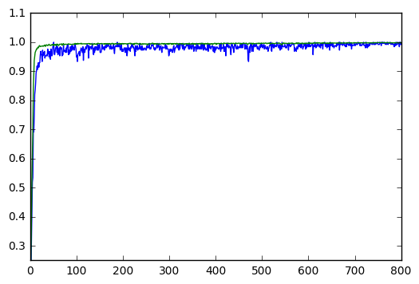


### 5. Model performance on unseen US traffic sign data

The model performs very well on the images that are similar to signs in the German data set. For example, stop sign and do not enter are classified correctly, with high certainty.


```python
saver = tf.train.Saver()
saver.restore(sess=session, save_path='model_best_test')
```


```python
print_accuracy()
```

    Accuracy on test set:  98.8%


```python
def process_newimage_file(name):
    image = cv2.imread(name)
    image = cv2.resize(image,(32,32))
    image = cv2.cvtColor(image,cv2.COLOR_BGR2RGB)
    image = image/255.-.5
    return image

def plot_newImage_3C(n_row,n_col,X):

    plt.figure(figsize = (8,6))
    gs1 = gridspec.GridSpec(n_row,n_row)
    gs1.update(wspace=0.01, hspace=0.02) # set the spacing between axes.

    for i in range(n_row*n_col):
        # i = i + 1 # grid spec indexes from 0
        ax1 = plt.subplot(gs1[i])
        plt.axis('on')
        ax1.set_xticklabels([])
        ax1.set_yticklabels([])
        ax1.set_aspect('equal')
        #plt.subplot(4,11,i+1)
        ind_plot = i
        plt.imshow(X[ind_plot])
        plt.axis('off')
    plt.show()
```


```python
newdata = [process_newimage_file("./new_signs/"+name) for name in os.listdir("./new_signs/")]
namenewdata = [name for name in os.listdir("./new_signs/")]
newdata = np.array(newdata ,dtype = np.float32)
```


```python
plot_newImage_3C(5,5,newdata+.5)
```


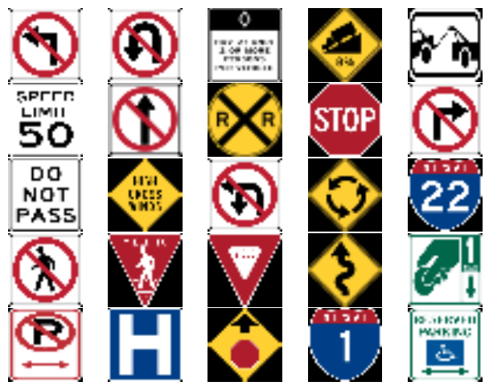


```python
#labels_pred = tf.nn.softmax(fc_layer3)
feed_dict_new = {features:newdata,
                            keep_prob: 1}
top5 = tf.nn.top_k(labels_pred, 5)

predictions = session.run(labels_pred,feed_dict = feed_dict_new)
top5_pred = session.run([labels_pred, top5], feed_dict=feed_dict_new)
```


```python
for i in range(40):
    plt.figure(figsize = (5,1.5))
    gs = gridspec.GridSpec(1, 2,width_ratios=[2,3])
    plt.subplot(gs[0])
    plt.imshow(newdata[i]+.5)
    plt.axis('off')
    plt.subplot(gs[1])
    plt.barh(6-np.arange(5),top5_pred[1][0][i], align='center')
    for i_label in range(5):
        plt.text(top5_pred[1][0][i][i_label]+.02,6-i_label-.25,
            data_pd['SignName'][top5_pred[1][1][i][i_label]])
    plt.axis('off');
    plt.text(0,6.95,namenewdata[i].split('.')[0]);
    plt.show();

```


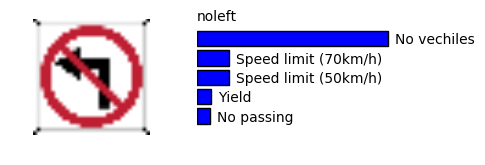


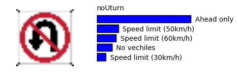


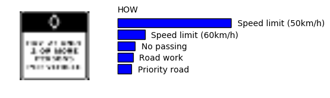


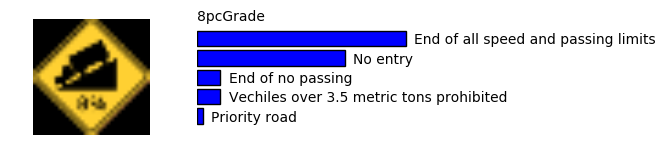


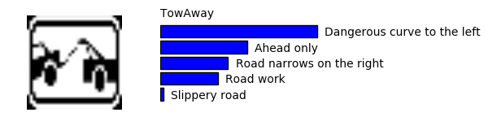


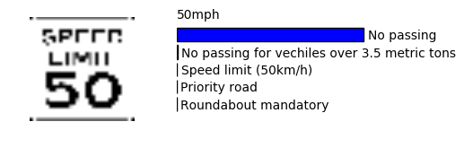


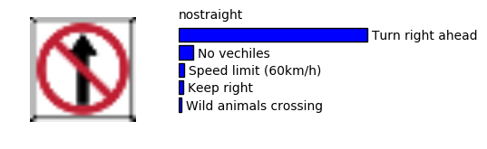


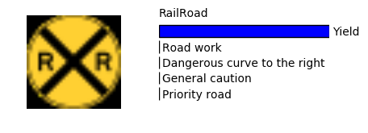


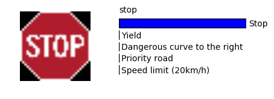


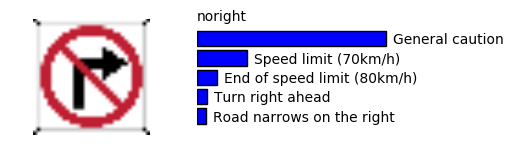


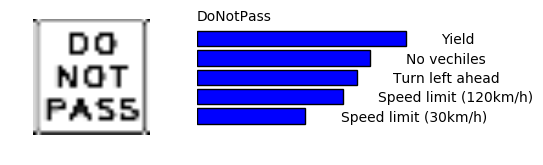


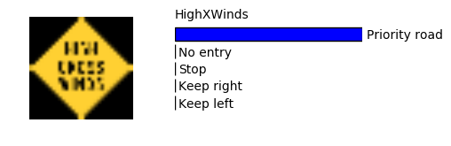


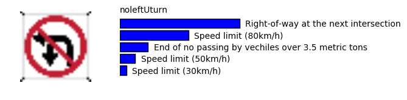


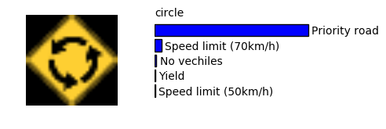


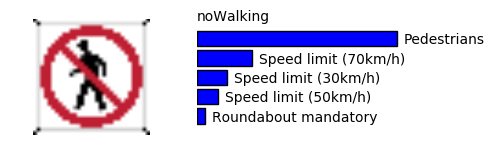


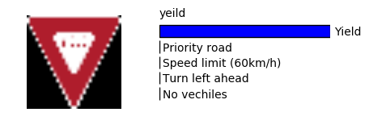


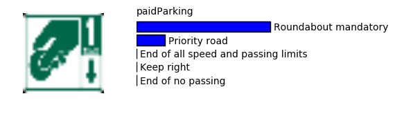


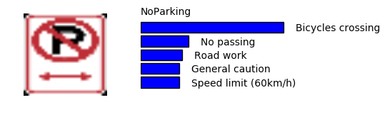


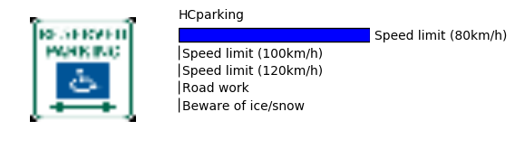


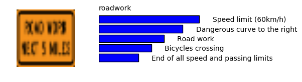


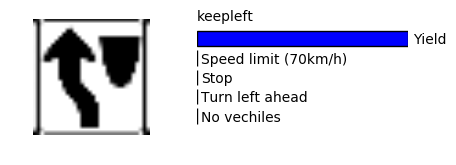


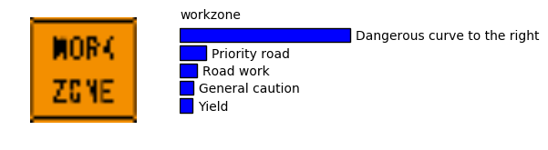


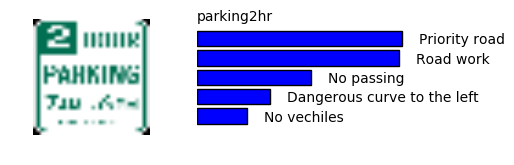


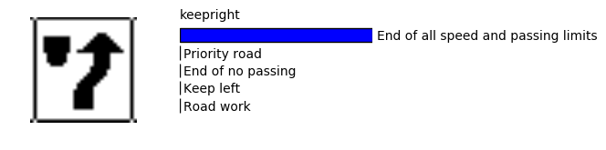


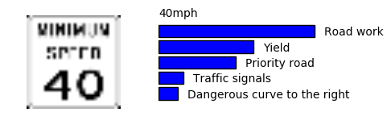


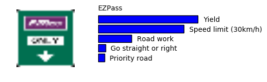


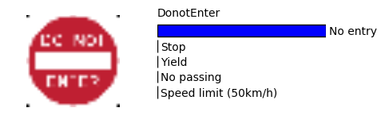


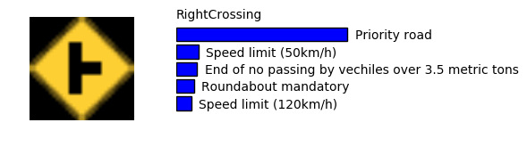


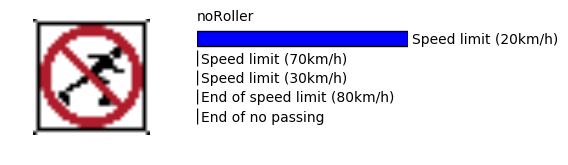


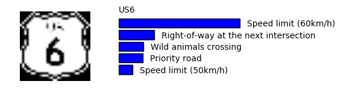


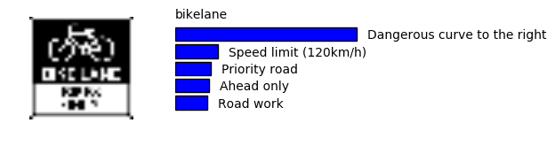


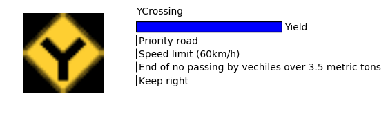


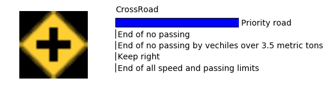


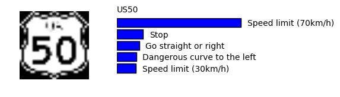


### Reflections

This was a very interesting project, and probably the first time I tackled deep learning problem from scratch to a stage where I could compare performance against those published in literature. There are several things that can be tried to further improve the model. One easy thing to do is to let the model train for longer time. As each training cycle was taking about 4 hours I did not perform any hyper parameter optimization to choose the best learning rate or regularization.

### Acknowledgements:

I am very thankful to Udacity for selecting me for the first cohort, this allowed me to connect with many like-minded individuals. I especially learned a lot from discussions with Henrik Tünnermann and John Chen. I am also thankful for getting the NVIDA’s GPU grant. Although, its for work, but I use it for Udacity too. :)
